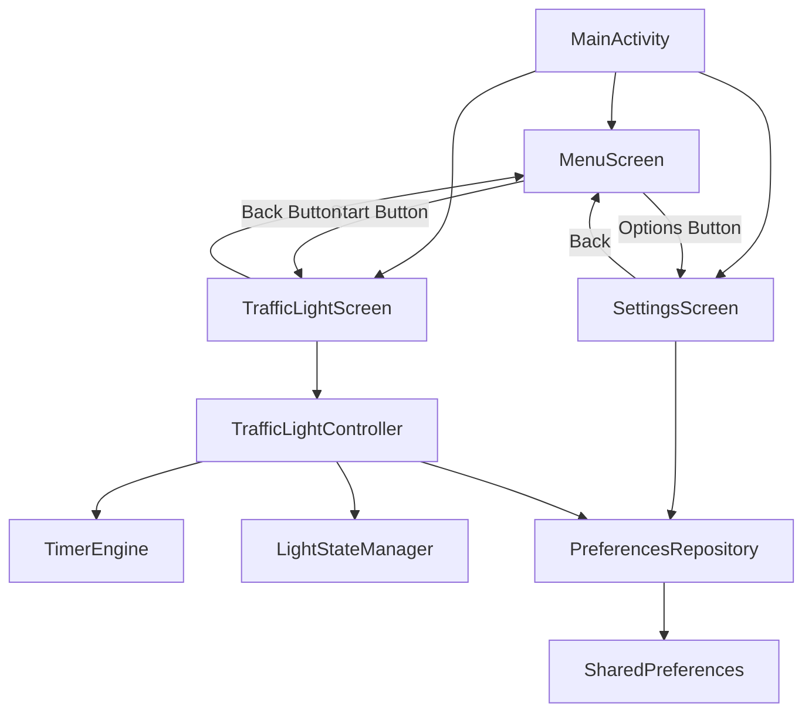
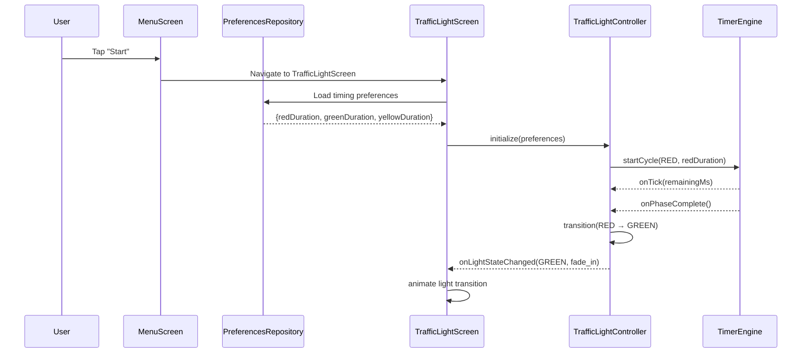
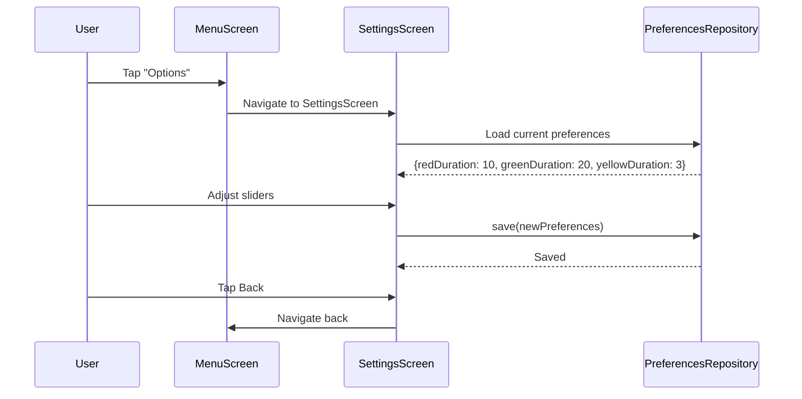
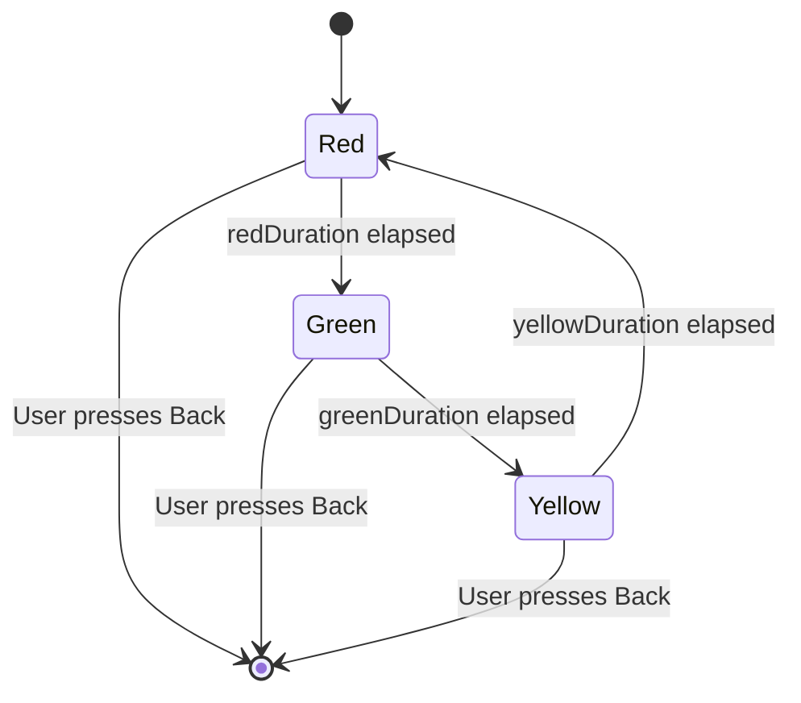
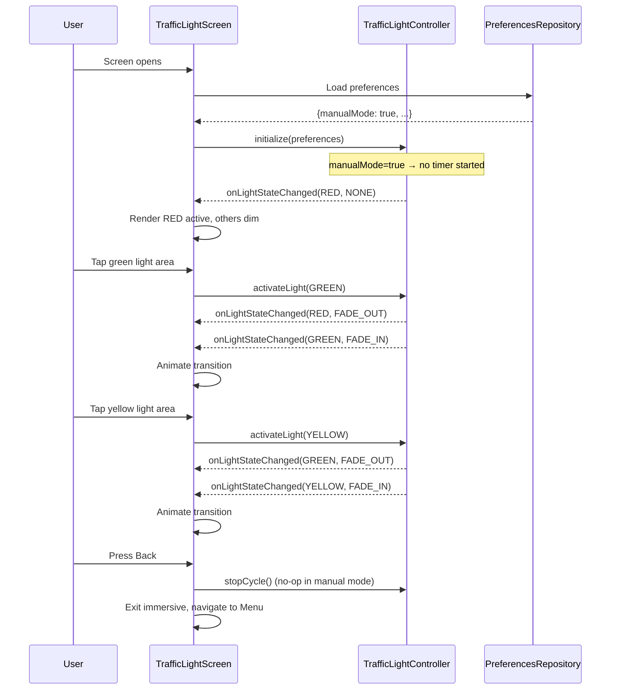

# Design Document: Traffic Light App

## Overview

A full-screen Android app that simulates a realistic traffic light for kids playing with ride-on toys or scale model vehicles. This document covers architecture, component design, data models, and algorithms.

## Architecture



## Sequence Diagrams

### Main Flow: Starting the Traffic Light



### Settings Flow



### Light Cycle State Machine



### Manual Mode Flow



## Components and Interfaces

### Component 1: MenuScreen

**Purpose**: Entry point of the app. Displays "Start" and "Options" buttons centered on screen.

```pascal
INTERFACE MenuScreen
  PROCEDURE onStartPressed()
    // Navigate to TrafficLightScreen
  END PROCEDURE
  
  PROCEDURE onOptionsPressed()
    // Navigate to SettingsScreen
  END PROCEDURE
END INTERFACE
```

**Responsibilities**:
- Display two Material Design buttons vertically centered
- Handle navigation to TrafficLightScreen and SettingsScreen
- Display app title/branding above buttons

### Component 2: TrafficLightScreen

**Purpose**: Full-screen display showing the traffic light with animated transitions. Supports both automatic cycling and manual tap-to-activate modes.

```pascal
INTERFACE TrafficLightScreen
  PROCEDURE onCreate()
    // Enter immersive full-screen mode
    // Load preferences
    // Initialize controller
    // If automatic mode: start cycle
    // If manual mode: display RED active, await taps
  END PROCEDURE
  
  PROCEDURE onLightStateChanged(newState: LightState, animation: AnimationType)
    // Update the rendered light display with fade animation
  END PROCEDURE
  
  PROCEDURE onLightTapped(light: LightState)
    // Manual mode only: forward tap to controller.activateLight()
    // Automatic mode: no-op (taps ignored)
  END PROCEDURE
  
  PROCEDURE onBackPressed()
    // Stop the cycle, return to MenuScreen
  END PROCEDURE
  
  PROCEDURE onDestroy()
    // Clean up timers and resources
  END PROCEDURE
END INTERFACE
```

**Responsibilities**:
- Render the traffic light housing and three light circles
- Show active light at full brightness, inactive lights as dim circles
- Animate transitions with incandescent-style fade out/in
- Hide system bars for immersive full-screen experience
- Handle back button to stop and return to menu
- In manual mode: register tap targets on each light area and forward taps to controller
- In automatic mode: ignore taps on lights

### Component 3: TrafficLightController

**Purpose**: Manages the state machine logic for light transitions and timing. Supports both automatic cycle mode and manual (user-tap) mode.

```pascal
INTERFACE TrafficLightController
  PROCEDURE initialize(preferences: TimingPreferences)
    // Set up timing values and start from RED state
    // If preferences.manualMode is true, do not start timer
  END PROCEDURE
  
  PROCEDURE startCycle()
    // Begin continuous cycling from current state (automatic mode only)
  END PROCEDURE
  
  PROCEDURE stopCycle()
    // Cancel all timers, reset state
    // Safe to call in manual mode (no-op)
  END PROCEDURE
  
  PROCEDURE activateLight(state: LightState)
    // Manual mode only: activate the given light, deactivate others
    // If state is already active, no-op
    // Triggers onLightStateChanged with FADE_OUT for previous and FADE_IN for new
  END PROCEDURE
  
  FUNCTION getCurrentState(): LightState
    // Return current light state
  END FUNCTION
  
  FUNCTION isManualMode(): Boolean
    // Return whether controller is operating in manual mode
  END FUNCTION
  
  EVENT onLightStateChanged(newState: LightState, animation: AnimationType)
    // Fired when light transitions to a new state
  END EVENT
END INTERFACE
```

**Responsibilities**:
- Implement state machine: RED → GREEN → YELLOW → RED (continuous) in automatic mode
- In manual mode, wait for explicit `activateLight()` calls instead of timer-driven transitions
- Manage transition timing based on user preferences
- Coordinate with TimerEngine for accurate countdowns (automatic mode only)
- Notify listeners of state changes with animation type
- `stopCycle()` is safe to call in either mode

### Component 4: TimerEngine

**Purpose**: Provides accurate countdown timing using Android's CountDownTimer or Handler-based approach.

```pascal
INTERFACE TimerEngine
  PROCEDURE start(durationMs: Integer, onComplete: Callback)
    // Start countdown for given duration
  END PROCEDURE
  
  PROCEDURE cancel()
    // Cancel current countdown
  END PROCEDURE
  
  FUNCTION isRunning(): Boolean
    // Return whether timer is actively counting
  END FUNCTION
END INTERFACE
```

**Responsibilities**:
- Provide reliable millisecond-accurate timing
- Handle lifecycle interruptions (app backgrounded)
- Clean cancellation without memory leaks

### Component 5: SettingsScreen

**Purpose**: Allow users to adjust timing for each light phase and toggle manual mode.

```pascal
INTERFACE SettingsScreen
  PROCEDURE onCreate()
    // Load current preferences and display sliders
  END PROCEDURE
  
  PROCEDURE onRedDurationChanged(seconds: Integer)
    // Update red duration preference
  END PROCEDURE
  
  PROCEDURE onGreenDurationChanged(seconds: Integer)
    // Update green duration preference
  END PROCEDURE
  
  PROCEDURE onYellowDurationChanged(seconds: Integer)
    // Update yellow duration preference
  END PROCEDURE
  
  PROCEDURE onManualModeChanged(enabled: Boolean)
    // Update manual mode preference
  END PROCEDURE
  
  PROCEDURE onResetDefaults()
    // Reset all values to defaults (including manual mode → false)
  END PROCEDURE
END INTERFACE
```

**Responsibilities**:
- Display Material Design sliders for each light duration
- Display a Material 3 Switch for manual mode toggle
- Show current values as labels next to sliders
- Save preferences immediately on change (sliders and toggle)
- Provide "Reset to Defaults" option

### Component 6: PreferencesRepository

**Purpose**: Abstraction layer over SharedPreferences for reading/writing timing settings and manual mode preference.

```pascal
INTERFACE PreferencesRepository
  FUNCTION getTimingPreferences(): TimingPreferences
    // Read saved or default timing values (including manualMode)
  END FUNCTION
  
  PROCEDURE saveTimingPreferences(prefs: TimingPreferences)
    // Persist timing values and manual mode locally
  END PROCEDURE
  
  PROCEDURE resetToDefaults()
    // Clear saved values, revert to defaults (manualMode → false)
  END PROCEDURE
END INTERFACE
```

**Responsibilities**:
- Read/write to Android SharedPreferences
- Provide default values when no saved preferences exist (manualMode defaults to false)
- Validate values are within acceptable ranges

## Data Models

### Model 1: LightState

```pascal
ENUMERATION LightState
  RED
  YELLOW
  GREEN
END ENUMERATION
```

### Model 2: AnimationType

```pascal
ENUMERATION AnimationType
  FADE_IN       // Light turning on (brightening)
  FADE_OUT      // Light turning off (dimming like incandescent)
  NONE          // Initial state, no animation
END ENUMERATION
```

### Model 3: TimingPreferences

```pascal
STRUCTURE TimingPreferences
  redDurationSeconds: Integer      // Default: 10, Range: 3-60
  greenDurationSeconds: Integer    // Default: 20, Range: 3-60
  yellowDurationSeconds: Integer   // Default: 3,  Range: 1-10
  manualMode: Boolean              // Default: false
END STRUCTURE
```

### Model 4: LightDisplayState

```pascal
STRUCTURE LightDisplayState
  redBrightness: Float        // 0.0 (dim) to 1.0 (full)
  yellowBrightness: Float     // 0.0 (dim) to 1.0 (full)
  greenBrightness: Float      // 0.0 (dim) to 1.0 (full)
END STRUCTURE

CONSTANT DIM_BRIGHTNESS = 0.15
CONSTANT FULL_BRIGHTNESS = 1.0
```

## Algorithmic Pseudocode

### Traffic Light Cycle

```pascal
ALGORITHM trafficLightCycle(preferences)
INPUT: preferences of type TimingPreferences
OUTPUT: continuous cycle until stopped

BEGIN
  currentState ← RED
  isRunning ← true
  
  NOTIFY onLightStateChanged(RED, NONE)
  
  WHILE isRunning DO
    duration ← getDurationForState(currentState, preferences)
    WAIT duration seconds
    
    IF NOT isRunning THEN EXIT WHILE END IF
    
    previousState ← currentState
    currentState ← getNextState(currentState)
    
    NOTIFY onLightStateChanged(previousState, FADE_OUT)
    WAIT 300 milliseconds
    NOTIFY onLightStateChanged(currentState, FADE_IN)
  END WHILE
END
```

**Preconditions:** preferences contains valid timing values; listener is registered
**Postconditions:** When isRunning becomes false, all timers are cancelled; no lingering callbacks
**Loop Invariants:** currentState is always a valid LightState; isRunning only transitions true → false

### State Transition

```pascal
ALGORITHM getNextState(currentState)
BEGIN
  IF currentState = RED THEN RETURN GREEN
  ELSE IF currentState = GREEN THEN RETURN YELLOW
  ELSE IF currentState = YELLOW THEN RETURN RED
  END IF
END
```

**Postconditions:** Pure function, deterministic, no side effects

### Manual Light Activation

```pascal
ALGORITHM activateLight(targetState, currentState, isManualMode)
INPUT: targetState (LightState), currentState (LightState), isManualMode (Boolean)
OUTPUT: state change notification or no-op

BEGIN
  IF NOT isManualMode THEN RETURN END IF
  IF targetState = currentState THEN RETURN END IF
  
  previousState ← currentState
  currentState ← targetState
  
  NOTIFY onLightStateChanged(previousState, FADE_OUT)
  WAIT 300 milliseconds
  NOTIFY onLightStateChanged(targetState, FADE_IN)
END
```

**Preconditions:** isManualMode is true; targetState is a valid LightState
**Postconditions:** Exactly one light is active; transition animation plays; no timer started

### Fade Animation

```pascal
ALGORITHM animateLightTransition(targetLight, direction, durationMs)
BEGIN
  IF direction = FADE_OUT THEN
    startBrightness ← FULL_BRIGHTNESS
    endBrightness ← DIM_BRIGHTNESS
  ELSE
    startBrightness ← DIM_BRIGHTNESS
    endBrightness ← FULL_BRIGHTNESS
  END IF
  
  elapsed ← 0
  WHILE elapsed < durationMs DO
    progress ← elapsed / durationMs
    IF direction = FADE_OUT THEN
      interpolated ← 1.0 - (1.0 - progress)^2
    ELSE
      interpolated ← progress^2
    END IF
    currentBrightness ← startBrightness + (endBrightness - startBrightness) * interpolated
    SET targetLight.brightness TO currentBrightness
    RENDER frame
    elapsed ← elapsed + FRAME_INTERVAL
  END WHILE
  SET targetLight.brightness TO endBrightness
END
```

**Loop Invariants:** currentBrightness always in [DIM_BRIGHTNESS, FULL_BRIGHTNESS]; elapsed monotonically increases

### Preferences Validation

```pascal
ALGORITHM validateAndClamp(preferences)
BEGIN
  validPreferences.redDurationSeconds ← CLAMP(preferences.redDurationSeconds, 3, 60)
  validPreferences.greenDurationSeconds ← CLAMP(preferences.greenDurationSeconds, 3, 60)
  validPreferences.yellowDurationSeconds ← CLAMP(preferences.yellowDurationSeconds, 1, 10)
  RETURN validPreferences
END

FUNCTION CLAMP(value, min, max)
  IF value < min THEN RETURN min
  ELSE IF value > max THEN RETURN max
  ELSE RETURN value
  END IF
END FUNCTION
```

**Postconditions:** All returned values within valid ranges; values already in range are unchanged

## Key Functions

### enterImmersiveMode()

```pascal
PROCEDURE enterImmersiveMode()
  // Hide system bars (status bar, navigation bar)
  // Set window flags for full-screen immersive sticky mode
  // Lock orientation to portrait
END PROCEDURE
```

**Preconditions:** Activity is in RESUMED state; window is available
**Postconditions:** System bars hidden; orientation locked to portrait

### renderTrafficLight(displayState)

```pascal
PROCEDURE renderTrafficLight(displayState: LightDisplayState)
  // Draw housing (rounded rectangle)
  // Draw three circles vertically: red (top), yellow (middle), green (bottom)
  // Each circle color = blend(dimColor, activeColor, brightness)
END PROCEDURE
```

**Preconditions:** Canvas is measured and laid out; brightness values in [0.0, 1.0]
**Postconditions:** Housing centered horizontally; lights evenly spaced vertically

### stopAndNavigateBack()

```pascal
PROCEDURE stopAndNavigateBack()
  controller.stopCycle()
  exitImmersiveMode()
  navigateTo(MenuScreen)
END PROCEDURE
```

**Preconditions:** TrafficLightScreen is current; controller exists
**Postconditions:** All timers cancelled; system bars restored; MenuScreen displayed; no memory leaks

## Component 7: HdrCapabilityProvider

**Purpose**: Detects HDR display capability at runtime and provides a brightness headroom multiplier to the rendering pipeline.

```pascal
INTERFACE HdrCapabilityProvider
  FUNCTION isHdrAvailable(display: Display): Boolean
    // Check Display.isHdrSdrRatioAvailable() (API 34+)
  END FUNCTION

  FUNCTION getHeadroomMultiplier(display: Display): Float
    // Returns 2.0 if HDR available, 1.0 otherwise
  END FUNCTION

  PROCEDURE configureWindow(window: Window, hdrAvailable: Boolean)
    // Set COLOR_MODE_HDR on the window when supported
  END PROCEDURE
END INTERFACE
```

**Responsibilities**:
- Query display HDR capability via `Display.isHdrSdrRatioAvailable()`
- Return a fixed 2.0× multiplier on HDR displays, 1.0× on SDR displays
- Configure window color mode to HDR when supported
- Gracefully degrade on API 33 devices (no HDR APIs available → always return 1.0)

### HDR Rendering Pipeline Changes

The rendering pipeline in `TrafficLightComposable` is modified as follows:

1. `HdrCapabilityProvider.getHeadroomMultiplier()` is queried once when the TrafficLightScreen opens
2. The multiplier is passed to `drawIncandescentGlow()` and applied to:
   - The radial gradient color stops (center, mid, edge) — values scaled into extended sRGB (e.g., red 1.0 × 2.0 = 2.0)
   - The outer glow halo alpha/color values
3. Colors are constructed in `ColorSpace.Named.EXTENDED_SRGB` when headroom > 1.0
4. On SDR devices (multiplier = 1.0), all colors remain in standard sRGB — zero visual change

```pascal
ALGORITHM applyHdrHeadroom(color, headroom)
INPUT: color (r, g, b, a), headroom (Float)
OUTPUT: extended-range color

BEGIN
  IF headroom <= 1.0 THEN RETURN color END IF
  RETURN Color(r * headroom, g * headroom, b * headroom, a, EXTENDED_SRGB)
END
```

## Error Handling

### Timer Interruption (App Backgrounded)
**Condition**: User switches away while running
**Recovery**: On onResume(), verify timer is running. If not, restart cycle from RED.

### Invalid Preference Values
**Condition**: SharedPreferences contains corrupted or out-of-range values
**Recovery**: Run validateAndClamp() on load; use clamped values silently.

### Render Failure
**Condition**: Custom view fails to draw
**Recovery**: Fall back to simple colored backgrounds; automatic on next draw cycle.

### HDR Unavailable
**Condition**: Device does not support HDR or runs API < 34
**Recovery**: Headroom multiplier defaults to 1.0; rendering is pixel-identical to current SDR behavior. No error surfaced to user.
