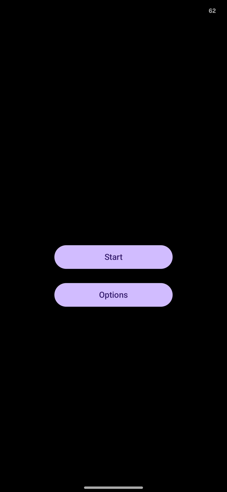
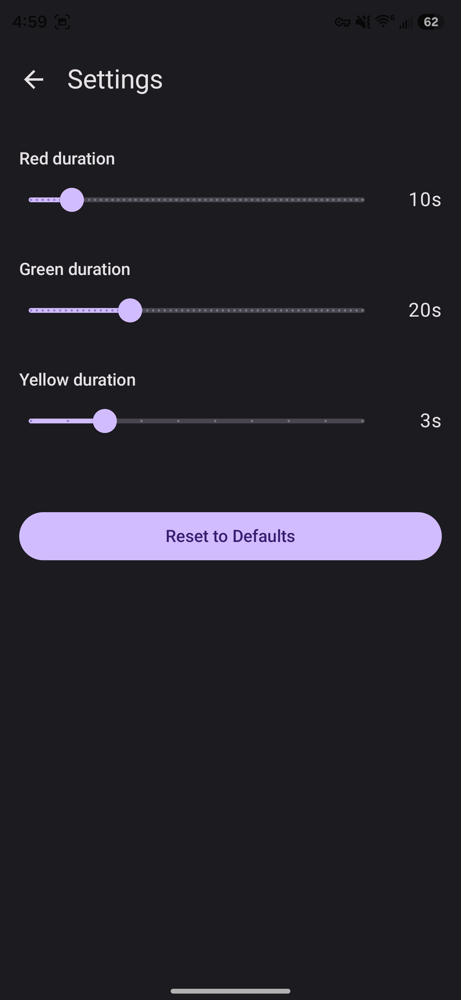
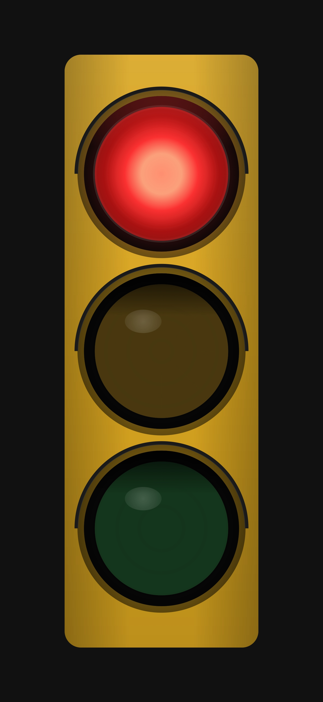
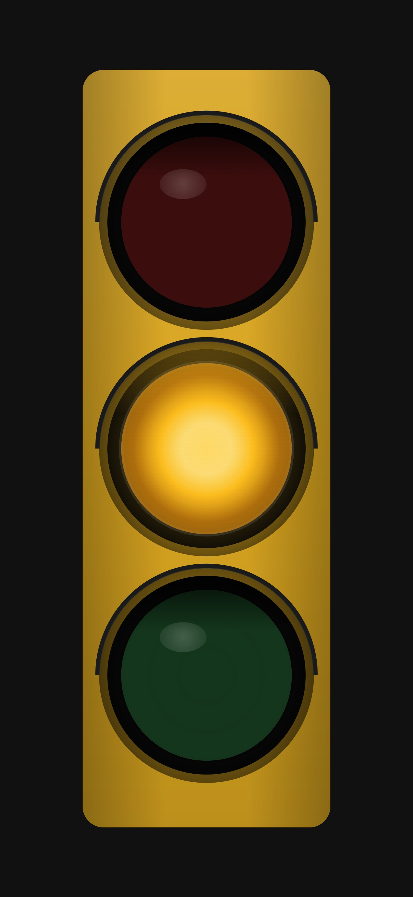
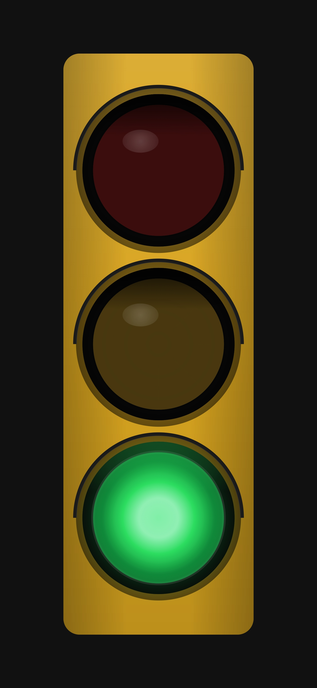

# AI-Assisted Development Bootcamp — Capstone Summary

> **Note:** This project requires **Kiro version 1.0**. If you are still on a 0.x release, please upgrade before proceeding — several features used here (specs, hooks, steering) have breaking changes from the 0.x line.

## Project - Traffic Light Simulator

### Why
I have for a long time wanted to build a traffic light simulator for my toddler who loves cars. When we plays "cars cars" he's enjoyed stopping for a "red light" and taking off on green. The other apps on the Play Store were found to be too unnecessarily complex and/or cluttered with ads. This is a simple no-ad take on the concept for self-play.

### What

An Android app (Kotlin/Jetpack Compose) that attempts to demonstrate as many Slalom AI Bootcamp concepts as possible across the seven sessions.

The app is a semi-realistic traffic light simulator with configurable phase timings. Three screens: a menu to launch or configure, a settings screen with sliders for red/yellow/green durations, and a full-screen immersive traffic light that cycles through phases with incandescent-style fade animations.

Screenshots:

 
 
  

## AI Capabilities Demonstrated

### 1. Spec-Driven Development

Used Kiro's structured spec workflow to go from rough idea → formal requirements → technical design → implementation tasks. Two specs were created:

| Spec | Workflow | What it produced |
|------|----------|-----------------|
| Traffic Light App | Design-first | Design doc → functional requirements → task list |
| GitHub Actions CI/CD | Requirements-first | Requirements doc → task list |

The spec process enforced acceptance criteria on every task before any code was written.

### 2. Requirements from Meeting Artifacts (Multi-Modal Input)

Fed real-world meeting artifacts directly into Kiro to synthesize structured requirements:

- **Whiteboard sketch** (JPEG photo) — annotated UI layout with visor details, app name placement, and manual mode concept
- **Meeting notes** (markdown) — captured decisions about visors, app title, and a new manual-mode feature
- **Visual design spec** (detailed markdown) — full signal construction layers (housing, visor, bezel, Fresnel lens), incandescent light model, color values, and animation curves

These unstructured inputs were transformed into formal acceptance criteria and integrated into the existing task list. This demonstrates using AI to bridge the gap between whiteboard conversations and actionable implementation specs.

### 3. Context Engineering (Steering Files)

Created 6 steering files in `.kiro/steering/` that persistently inject project-specific context into every AI interaction:

- **coding-guidelines.md** — Language, architecture, formatting rules
- **ui-guidelines.md** — Color palette, layout specs, animation details
- **testing-strategy.md** — Test framework choices, property-based testing expectations
- **task-execution-workflow.md** — Enforcement rules for how tasks get implemented
- **mcp-usage.md** — When and how to use external tool integrations
- **dev-preferences.md** — Portability constraints (no hardcoded paths)

These are the Kiro equivalent of `copilot-instructions.md` — persistent memory that shapes all AI output without repeating yourself.

### 4. Agent Hooks (Workflow Automation)

Set up two user-triggered hooks in `.kiro/hooks/`:

- **Commit and Push** — Reviews the diff, generates a Conventional Commits message from the branch name, stages, commits, and pushes. One button replaces a 5-step manual workflow.
- **Refresh to Main** — Checks for uncommitted changes, switches to `main`, and pulls latest. Safely resets the workspace between tasks.
- **Sync Meeting Notes to Spec** — When a new file lands in `docs/stories/`, prompts the agent to update design, requirements, and tasks docs, keeping the spec in sync with meeting decisions.

These demonstrate event-driven agent actions — repeatable multi-step Git workflows triggered by a single click.

### 5. Custom Agent (Specialized AI Mode)

Created a **task-executor** agent (`.kiro/agents/task-executor.md`) with a focused role:

- Picks the next incomplete task from the spec
- Creates a feature branch
- Implements strictly from acceptance criteria
- Writes unit tests (Kotest)
- Runs build + tests
- Commits, pushes, and opens a PR via MCP

This demonstrates constraining AI behavior to a narrow, repeatable role — the agent cannot do design work, edit specs, or deviate from the task list.

### 6. MCP Integration (Tool-Augmented AI)

Configured two MCP servers in `.kiro/settings/mcp.json`:

| Server | Purpose |
|--------|---------|
| **GitHub MCP** (Docker, OAuth) | Create branches, push commits, open PRs — all from within the AI session |
| **Fetch MCP** (uvx) | Pull live Android developer docs to verify current API signatures |

The GitHub MCP enabled end-to-end task execution without leaving the IDE. The Fetch MCP kept API usage accurate against live documentation.

### 7. CI/CD Pipeline (Spec → Implementation)

Used the spec workflow to design and implement two GitHub Actions pipelines:

- **PR Validation** — Build, lint, test on every PR to `main` (with concurrency cancellation)
- **Release** — Build a signed-APK, create GitHub Release with date-based tag on merge to `main`

This demonstrated taking a non-trivial infrastructure concern through the full spec-driven process.

## Concept Mapping: GHCP Bootcamp → Kiro

| Bootcamp Concept | GHCP Tool | Kiro Equivalent |
|-----------------|-----------|-----------------|
| Persistent context | `copilot-instructions.md` | Steering files (`.kiro/steering/`) |
| Specialized AI modes | Custom `.agent.md` files | Custom agents (`.kiro/agents/`) |
| Spec-driven development | SpecKit slash commands | Kiro Spec workflow |
| Workflow automation | `.prompt.md` files | Kiro hooks (`.kiro/hooks/`) |
| Tool-augmented AI | GitHub MCP server | Kiro MCP config (`.kiro/settings/mcp.json`) |

## Key Takeaway

The same principles — context engineering, constrained agents, structured specs, tool integration, and automation hooks — apply regardless of which AI coding tool you use. The value is in understanding *why* each concept exists, not memorizing tool-specific syntax.

## Future Improvements

Remaining tasks already spec'd and ready for AI-driven execution:

**App**
- Task 10 — Integration and property-based test suite (full cycle timing, settings roundtrip, immersive mode)
- Task 11 — Manual mode: tap-to-activate lights with auto-cycle disabled
- Task 12 — Bugfix: housing glow spill and visor shadow extending past bezel
- Task 13 — HDR enhanced rendering on capable displays (extended-range colors)
- Task 14 — Modern adaptive launcher icon (fills all launcher masks cleanly)

**CI/CD**
- Task 4 — Path filtering on PR validation to skip Gradle build for docs-only changes
